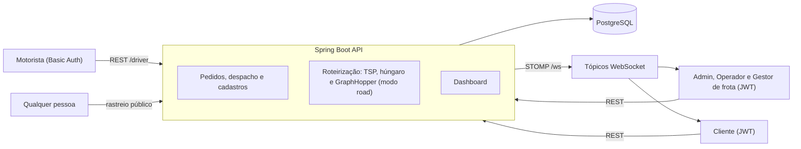

# Fluxos — Visão geral

Quem fala com a API e por qual canal. Índice em [flow-index.md](flow-index.md).

## 1. Fluxo geral

```mermaid
flowchart LR
    Cli["Cliente (JWT)"] -->|"REST"| API
    Staff["Admin, Operador e Gestor de frota (JWT)"] -->|"REST"| API
    Drv["Motorista (Basic Auth)"] -->|"REST /driver"| API
    Pub["Qualquer pessoa"] -->|"rastreio público"| API
    subgraph API["Spring Boot API"]
        Core["Pedidos, despacho e cadastros"]
        Rt["Roteirização: TSP, húngaro e GraphHopper (modo road)"]
        Dash["Dashboard"]
    end
    API --> DB[("PostgreSQL")]
    API -->|"STOMP /ws"| WS["Tópicos WebSocket"]
    WS --> Staff
    WS --> Cli
```
