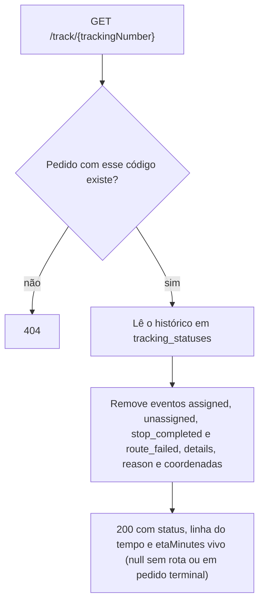

# Fluxos — Rastreio público

Consulta pública por código, sem dados pessoais. Índice em [flow-index.md](flow-index.md).

## 17. Rastreio público

```mermaid
flowchart TD
    A["GET /track/{trackingNumber}"] --> B{"Pedido com esse código existe?"}
    B -- não --> E["404"]
    B -- sim --> C["Lê o histórico em tracking_statuses"]
    C --> X["Remove eventos assigned, unassigned, stop_completed e route_failed, details, reason e coordenadas"]
    X --> H["200 com status, linha do tempo e etaMinutes vivo (null sem rota ou em pedido terminal)"]
```
