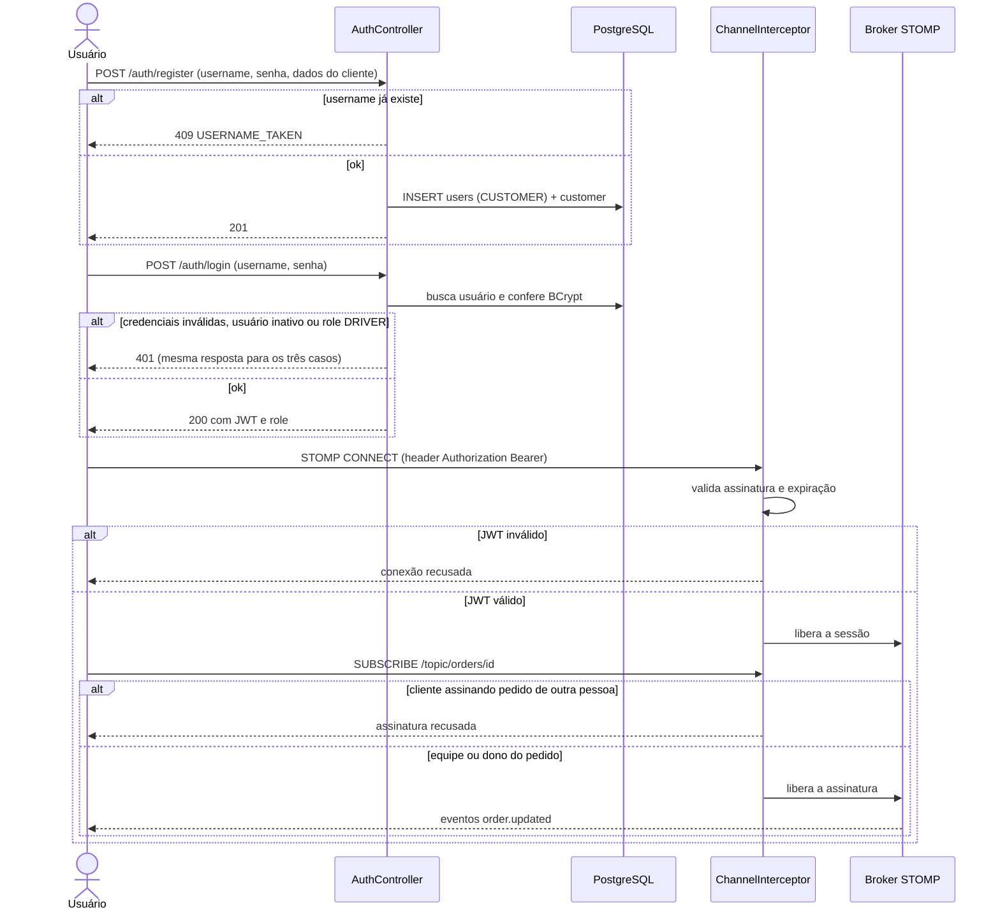

# Fluxos — Autenticação

Cadastro, login e conexão WebSocket. Índice em [flow-index.md](flow-index.md).

## 7. Cadastro, login e WebSocket

```mermaid
sequenceDiagram
    actor U as Usuário
    participant A as AuthController
    participant DB as PostgreSQL
    participant I as ChannelInterceptor
    participant B as Broker STOMP

    U->>A: POST /auth/register (username, senha, dados do cliente)
    alt username já existe
        A-->>U: 409 USERNAME_TAKEN
    else ok
        A->>DB: INSERT users (CUSTOMER) + customer
        A-->>U: 201
    end

    U->>A: POST /auth/login (username, senha)
    A->>DB: busca usuário e confere BCrypt
    alt credenciais inválidas, usuário inativo ou role DRIVER
        A-->>U: 401 (mesma resposta para os três casos)
    else ok
        A-->>U: 200 com JWT e role
    end

    U->>I: STOMP CONNECT (header Authorization Bearer)
    I->>I: valida assinatura e expiração
    alt JWT inválido
        I-->>U: conexão recusada
    else JWT válido
        I->>B: libera a sessão
        U->>I: SUBSCRIBE /topic/orders/id
        alt cliente assinando pedido de outra pessoa
            I-->>U: assinatura recusada
        else equipe ou dono do pedido
            I->>B: libera a assinatura
            B-->>U: eventos order.updated
        end
    end
```
