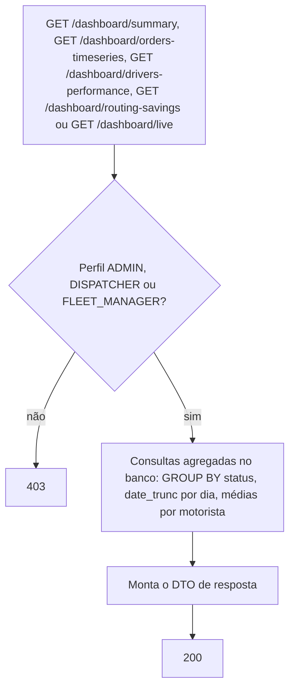

# Fluxos — Dashboard

Painéis por perfil. Índice em [flow-index.md](flow-index.md).

## 16. Dashboard

```mermaid
flowchart TD
    A["GET /dashboard/summary, GET /dashboard/orders-timeseries, GET /dashboard/drivers-performance, GET /dashboard/routing-savings ou GET /dashboard/live"] --> B{"Perfil ADMIN, DISPATCHER ou FLEET_MANAGER?"}
    B -- não --> E["403"]
    B -- sim --> C["Consultas agregadas no banco: GROUP BY status, date_trunc por dia, médias por motorista"]
    C --> D["Monta o DTO de resposta"]
    D --> OK["200"]
```
